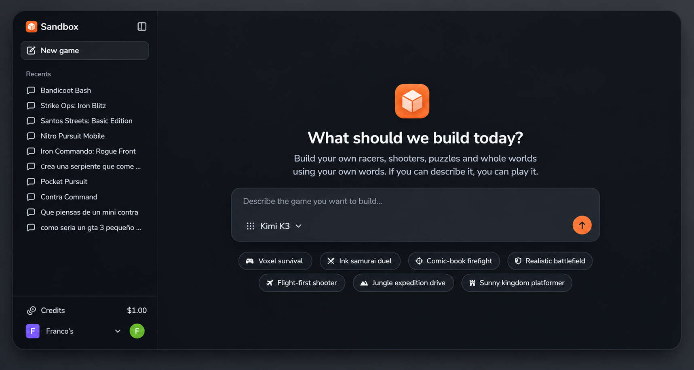

# Game-builder

<p align="center">
  
</p>

<p align="center">
  Turn a game idea into a creative, AI-assisted building session — just describe what you want to make.
</p>

<p align="center">
  
  
  
  
  
  
</p>

Game-builder is a web workspace for shaping game concepts through conversation. Start with a prompt — a sunny kingdom platformer, a fight-first shooter, or a voxel survival world — and keep developing the idea in a persistent AI chat.

> **Product status:** The current experience is an AI-assisted game-building conversation. An in-app playable preview is still on the roadmap.

## What you can do

- **Start from an idea** — describe a game or choose a curated prompt starter.
- **Build through chat** — continue the conversation in a streaming, resumable session powered by a Trigger.dev chat agent.
- **Return to recent games** — open your organization's games from the sidebar.
- **Stop or recover a turn** — cancel generation, retry when needed, and restore a reply from the saved conversation.
- **Keep work private to your organization** — Clerk Organizations and org-scoped database queries isolate each organization's games.
- **Use a polished workspace** — responsive app shell, dark mode, and a shared component system.

## How it works

1. The home composer sends the initial game idea to the `createGame` Server Action.
2. The action creates an organization-scoped game record with the first user message and immediately routes to `/games/[id]`.
3. A Trigger.dev `chat.agent` session streams the conversation using the configured Gemini chat model.
4. Transcript messages and session recovery state are saved to Postgres, so the conversation can be restored when you return.

```text
Prompt
  → createGame() Server Action
  → organization-scoped game + first message in Postgres
  → /games/[id] loads the saved transcript
  → Trigger.dev chat.agent streams the next reply
  → transcript and recovery state are persisted
```

## Implemented

- [x] Prompt-to-game session creation with curated starters.
- [x] Durable, streaming AI chat sessions using Trigger.dev.
- [x] Per-game transcript persistence and session recovery state.
- [x] Organization-scoped game creation, recent-game listing, and reads.
- [x] Background game-title generation with a fast provisional-title fallback.
- [x] Stop generation, retry, and recover a completed server-side reply.
- [x] Dark-mode-capable interface and responsive application shell.

## Roadmap

- [ ] Generate and display a playable game preview.
- [ ] Add game management actions such as rename, duplicate, and delete.
- [ ] Add per-game model and system-prompt settings.
- [ ] Add usage limits and rate limiting for AI generation.
- [ ] Add end-to-end coverage for the create-to-chat flow.

## Tech stack

| Area            | Technology                                                  |
| --------------- | ----------------------------------------------------------- |
| Framework       | Next.js 16, App Router, Server Actions                      |
| UI              | React 19, Tailwind CSS 4, shadcn/ui, Base UI, `next-themes` |
| Authentication  | Clerk Organizations                                         |
| Database        | Neon Postgres, `@neondatabase/serverless`                   |
| ORM             | Drizzle ORM and Drizzle Kit                                 |
| Chat runtime    | Trigger.dev durable chat agents                             |
| AI              | Vercel AI SDK with Google Gemini models                     |
| Validation      | Zod                                                         |
| Language        | TypeScript (strict)                                         |
| Package manager | pnpm (lockfile included)                                    |

## Getting started

### Prerequisites

- Node.js 24 or newer and pnpm
- A Neon Postgres database
- A Clerk application with Organizations enabled
- A Google AI Studio API key

### 1. Install dependencies

```bash
pnpm install
```

### 2. Configure environment variables

Create `.env.local` in the project root:

```dotenv
# Clerk — https://dashboard.clerk.com
NEXT_PUBLIC_CLERK_PUBLISHABLE_KEY=pk_test_...
CLERK_SECRET_KEY=sk_test_...

# Optional custom auth routes (Clerk defaults are used as fallback)
NEXT_PUBLIC_CLERK_SIGN_IN_URL=/sign-in
NEXT_PUBLIC_CLERK_SIGN_UP_URL=/sign-up
NEXT_PUBLIC_CLERK_SIGN_IN_FALLBACK_REDIRECT_URL=/
NEXT_PUBLIC_CLERK_SIGN_UP_FALLBACK_REDIRECT_URL=/

# Neon Postgres: pooled URL for the app, direct/unpooled URL for Drizzle Kit
DATABASE_URL=postgresql://...
DATABASE_URL_UNPOOLED=postgresql://...

# Google AI Studio — https://aistudio.google.com/apikey
GEMINI_API_KEY=AIza...
GEMINI_TITLE_MODEL=gemini-3.5-flash-lite
GEMINI_CHAT_MODEL=gemini-3.8-flash
```

The environment schema in `lib/env.ts` validates required values when server configuration is loaded. Model names can be changed with the corresponding `GEMINI_*_MODEL` variables.

### 3. Push the development schema

This project uses Drizzle Kit `push` during development; migration files are not maintained in this workflow. Set `DATABASE_URL_UNPOOLED` to the direct database URL, then run:

```bash
pnpm run db:push
```

To open Drizzle Studio:

```bash
pnpm run db:studio
```

### 4. Start the app and chat worker

In one terminal, run the web app:

```bash
pnpm run dev
```

In another terminal, start the local Trigger.dev worker:

```bash
pnpm run trigger:dev
```

Open [http://localhost:3000](http://localhost:3000), sign in, select or create an organization, and describe the game you want to build.

## Useful scripts

| Command                   | Purpose                                       |
| ------------------------- | --------------------------------------------- |
| `pnpm run dev`            | Start the Next.js development server          |
| `pnpm run build`          | Create a production build                     |
| `pnpm run start`          | Serve the production build                    |
| `pnpm run lint`           | Run Oxlint                                    |
| `pnpm run lint:fix`       | Apply Oxlint fixes                            |
| `pnpm run typecheck`      | Run `tsc --noEmit`                            |
| `pnpm run test`           | Run the Vitest suite once                     |
| `pnpm run test:watch`     | Run Vitest in watch mode                      |
| `pnpm run format`         | Format TypeScript and TSX files with Prettier |
| `pnpm run db:push`        | Push the schema with Drizzle Kit              |
| `pnpm run db:studio`      | Open Drizzle Studio                           |
| `pnpm run trigger:dev`    | Start the local Trigger.dev worker            |
| `pnpm run trigger:deploy` | Deploy Trigger.dev tasks                      |

## Project structure

```text
app/
  (app)/page.tsx              # Home composer and prompt starters
  (app)/games/[id]/page.tsx   # Game chat session
  (app)/layout.tsx            # Authenticated application layout
  sign-in/ sign-up/           # Clerk pages
  layout.tsx                  # Root layout and providers
components/
  create-game-composer.tsx    # Landing prompt → createGame
  chat-composer.tsx           # Shared chat input
  chat-thread.tsx             # Streaming chat and recovery UI
  app-sidebar.tsx             # Recent games navigation
  ui/                         # Shared UI primitives
trigger/
  chat.ts                     # Trigger.dev game-chat agent
lib/
  ai.ts                       # Gemini model configuration
  chat/                       # Transcript storage and session actions
  games/actions.ts            # Game creation and title generation
  games/queries.ts            # Organization-scoped game reads
  games/suggestions.ts        # Curated prompt starters
db/schema.ts                  # Games and transcript database schema
proxy.ts                      # Clerk route protection
```

## Contributing

Issues and pull requests are welcome. Keep changes focused and run the relevant checks before submitting:

```bash
pnpm run typecheck
pnpm run lint
pnpm run test
```

Describe the motivation, implementation, and verification performed.

## License

Private project — all rights reserved unless a `LICENSE` file is added.
